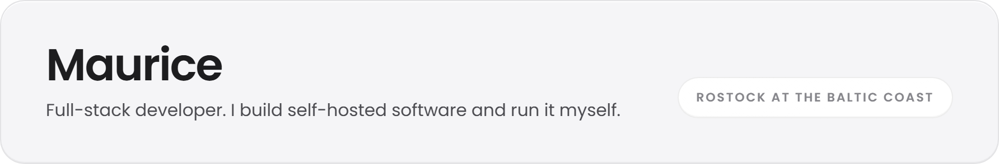
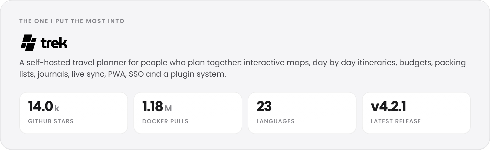
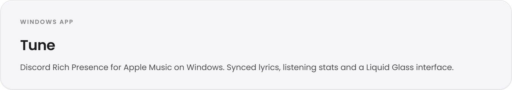
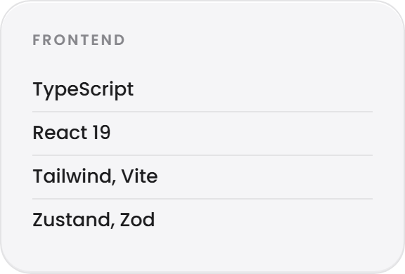
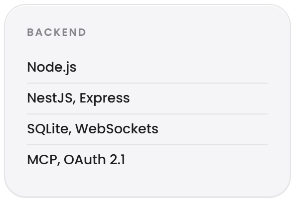
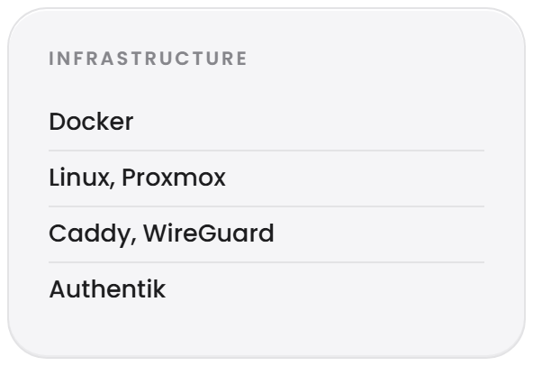
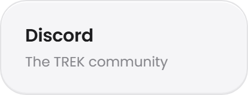
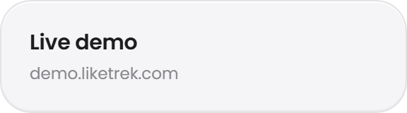
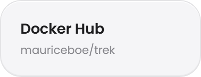
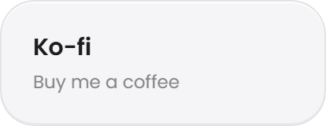

<picture>
  <source media="(prefers-color-scheme: dark)" srcset="assets/hero-dark.png" />
  
</picture>

<a href="https://github.com/liketrek/TREK">
  <picture>
    <source media="(prefers-color-scheme: dark)" srcset="assets/trek-dark.png" />
    
  </picture>
</a>

<a href="https://github.com/mauriceboe/Tune">
  <picture>
    <source media="(prefers-color-scheme: dark)" srcset="assets/tune-dark.png" />
    
  </picture>
</a>

<picture>
  <source media="(prefers-color-scheme: dark)" srcset="assets/stack-fe-dark.png" />
  
</picture><picture>
  <source media="(prefers-color-scheme: dark)" srcset="assets/stack-be-dark.png" />
  
</picture><picture>
  <source media="(prefers-color-scheme: dark)" srcset="assets/stack-infra-dark.png" />
  
</picture> 
<a href="https://discord.gg/7Q6M6jDwzf">
  <picture>
    <source media="(prefers-color-scheme: dark)" srcset="assets/link-discord-dark.png" />
    
  </picture>
</a><a href="https://demo.liketrek.com">
  <picture>
    <source media="(prefers-color-scheme: dark)" srcset="assets/link-demo-dark.png" />
    
  </picture>
</a><a href="https://hub.docker.com/r/mauriceboe/trek">
  <picture>
    <source media="(prefers-color-scheme: dark)" srcset="assets/link-docker-dark.png" />
    
  </picture>
</a><a href="https://ko-fi.com/mauriceboe">
  <picture>
    <source media="(prefers-color-scheme: dark)" srcset="assets/link-kofi-dark.png" />
    
  </picture>
</a>

